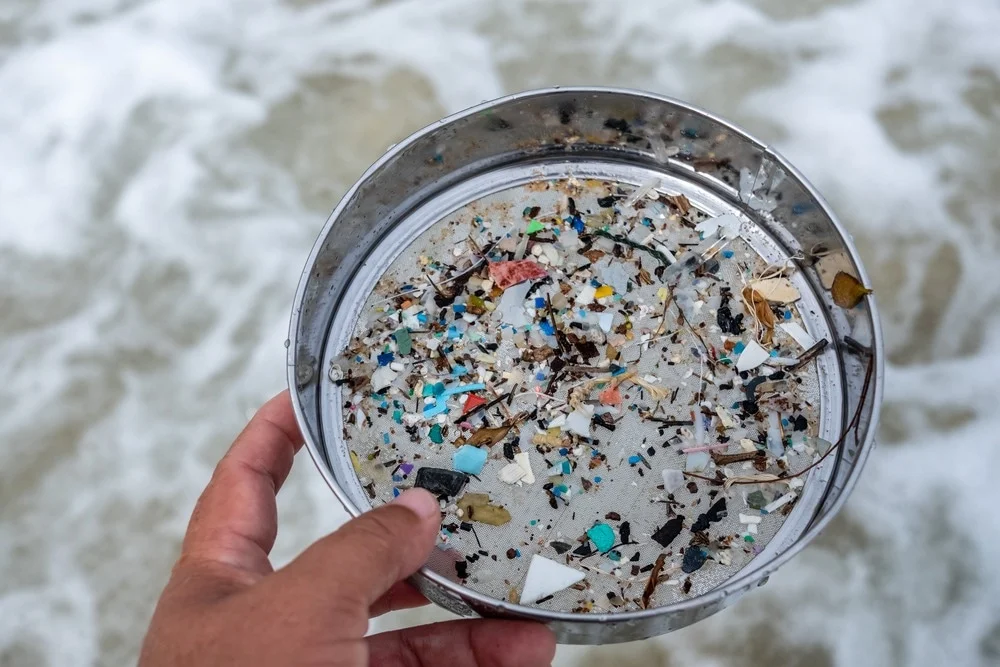
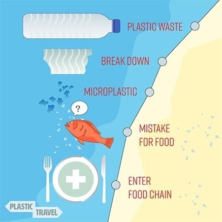

---
title: 'Microplastics: Understanding the Invisible Threat'
publication: 'La Terre, Volume 2 Issue 5'
publisher: 'Notre Dame Nature Study Club'
date: '2023-12'
tags:
  - 'Pollution'
  - 'Health'
  - 'Marine Science'
cover: 'microplastics-bottle-in-ocean.jpg'
pdf: 'Microplastics - Understanding the Invisible Threat.pdf'
---The presence of microplastics in the environment has become a pervasive issue with far-reaching consequences. These microscopic particles, often invisible to the naked eye, have infiltrated diverse ecosystems, creating a web of ecological and health concerns. In aquatic environments, microplastics accumulate in rivers, lakes, and oceans, posing a threat to marine organisms. Marine animals, including fish, birds, and marine mammals, may ingest these particles, leading to physical harm, internal blockages, and toxicity. Furthermore, microplastics have the potential to bioaccumulate and biomagnify in the food chain, ultimately reaching humans who consume contaminated seafood. Terrestrial ecosystems also face the consequences of microplastic pollution, as these particles can be found in soil and freshwater systems, impacting soil health, plant growth, and the overall functioning of ecosystems. Moreover, airborne microplastics have been detected in urban and remote areas, highlighting their ability to travel long distances and potentially affect human respiratory health. As a result, the widespread presence of microplastics underscores the urgent need for research, policy measures, and global collaboration to combat this environmental challenge. 

Microplastics can be classified into primary and secondary microplastics. Primary microplastics are intentionally manufactured at the microscale, such as microbeads in personal care products and microfibers from textiles. Secondary microplastics result from the fragmentation and degradation of larger plastic debris in the environment, such as plastic bottles, packaging, and fishing gear. These fragments can enter ecosystems through various pathways, including wastewater effluents, atmospheric deposition, and runoff. The issue with microplastics is that they do not easily degrade into harmless molecules, similar to other plastic products of any size. Plastics can take hundreds or even thousands of years to degrade, during which time they cause significant environmental damage. Microplastics may be seen on beaches as small pieces of plastic strewn over the sand in different colors. Marine creatures frequently eat microplastic waste in the waters. 

*Fragments sifted from shoreline sediment — the physical scale of what reaches the water.*

*From plastic waste to the food chain: how microplastics reach what we eat.*

Microplastics are found all over the world and have an impact on a variety of ecosystems. Microplastics build up in rivers, lakes, and seas, endangering marine life. Microplastics can cause physical injury, internal obstructions, and poisoning when consumed by marine species such as fish, birds, and marine mammals. 

*Larger fragments on the left give way to progressively smaller particles on the right.*

Additionally, microplastics have the ability to agglomerate and biomagnify in the food chain, eventually getting to people. In terrestrial environments, microplastics can be found in soil and freshwater systems, impacting soil health, plant growth, and the overall functioning of ecosystems. Moreover, airborne microplastics have been detected in urban and remote areas, highlighting their ability to travel long distances and potentially affect human respiratory health. Due to its desired qualities, including durability, flexibility, and resistance to deterioration, microplastics are widely employed in a variety of sectors and products. 

Some common applications of microplastics include: 

- Personal care products: Microbeads, often made of polyethylene or polypropylene, were commonly used in cosmetics, toothpaste, and exfoliating scrubs. However, many countries have banned or restricted the use of microbeads in these products due to their environmental impact.

- Textiles: Synthetic textiles, such as polyester and nylon, shed microfibers during washing and wear. These microfibers can enter wastewater systems and ultimately end up in aquatic environments. 

- Industrial abrasives: Microplastics are used as abrasives in various industrial processes, including sandblasting, polishing, and cleaning. These abrasives can be released into the environment during manufacturing or disposal. 

- Packaging materials: Plastic packaging, such as films, wrappers, and containers, can degrade over time, releasing microplastics into the environment. Moreover, plastic litter can break down into smaller fragments, further contributing to microplastic pollution. 

Given the pervasiveness and potential harm caused by microplastics, urgent actions are required to mitigate their release and impact. Some key strategies to address the microplastic challenge include: 

- Regulation and bans: Governments and regulatory bodies should enforce strict regulations and bans on the use of microplastics in various consumer products, including personal care items and cleaning agents. 

- Sustainable materials and product design: Industries should transition to sustainable and biodegradable alternatives to reduce the reliance on microplastics. Innovations in material science and product design can offer viable solutions, such as natural exfoliants, eco-friendly textiles, and compostable materials. 

- Wastewater treatment: Upgrading wastewater treatment plants to include advanced filtration systems can help capture microplastics before they are discharged into water bodies. This would reduce the input of microplastics into aquatic environments. 

- Public awareness and education: Increasing public awareness about microplastics and their environmental impact is crucial. Educational campaigns and initiatives can promote responsible consumption, proper waste management, and individual actions to reduce microplastic pollution. 

- Research and monitoring: Continued research and monitoring are essential to better understand the sources, distribution, and effects of microplastics. This knowledge can guide policy development, technological advancements, and mitigation strategies. 

The widespread occurrence of microplastics in ecosystems across the world has caused serious worries about their harmful effects on the environment and human health. These minute particles come from several sources and have gotten into different ecosystems, posing a major hazard. Microplastics are widely employed in many different industries and consumer items, which has an adverse effect on the environment and their global spread. To regulate and limit the use of microplastics, promote the use of sustainable alternatives, and implement improved waste management methods, urgent and collaborative actions are essential. By addressing the underlying causes of this problem, we can work to reduce the risks presented by microplastics, protect the health of our ecosystems, and ensure a healthy future for future generations. 

In conclusion, the insidious infiltration of microplastics into ecosystems globally underscores a pressing environmental crisis that threatens the intricate harmony of nature. These minuscule particles, pervasive in our soil, water bodies, and even the atmosphere, exert a detrimental impact on fundamental ecological processes. They disrupt the intricate web of life, from soil microorganisms to apex predators, impairing food chains and diminishing biodiversity. Furthermore, the pervasive presence of microplastics poses an imminent danger to human health, as these pollutants accumulate in the tissues of marine and terrestrial organisms, eventually entering the human food chain. Urgent and concerted action is imperative to confront this formidable challenge. Governments must enact and enforce stringent regulations on plastic production and disposal, while industries and individuals must embrace sustainable practices and alternatives. Only through collaborative endeavors can we aspire to restore and safeguard the delicate balance of our planet's ecosystems, securing a healthier future for all living beings. 

## References

1. Cox, K. D., Covernton, G. A., Davies, H. L., Dower, J. F., Juanes, F., & Dudas, S. E. (2019). Human Consumption of Microplastics. Environmental Science & Technology, 53(12), 7068– 7074. 

2. Hale, R. C., Seeley, M. E., La Guardia, M. J., Mai, L., & Zeng, E. Y. (2020). A Global Perspective on Microplastics. Journal of Geophysical Research: Oceans, 125(1). 

3. Lim, X. Z. (2021). Microplastics are everywhere — but are they harmful? Nature, 593(7857), 22–25. 

4. Peng, J., Wang, J., & Cai, L. (2017). Current understanding of microplastics in the environment: Occurrence, fate, risks, and what we should do. Integrated Environmental Assessment and Management, 13(3), 476–482. 

5. Campanale, C., Massarelli, C., Savino, I., Locaputo, V., & Uricchio, V. F. (2020). A Detailed Review Study on Potential Effects of Microplastics and Additives of Concern on Human Health. International Journal of Environmental Research and Public Health, 17(4), 1212. 

6. Bhuyan, Md. S. (2022). Effects of Microplastics on Fish and in Human Health. Frontiers in Environmental Science, 10
